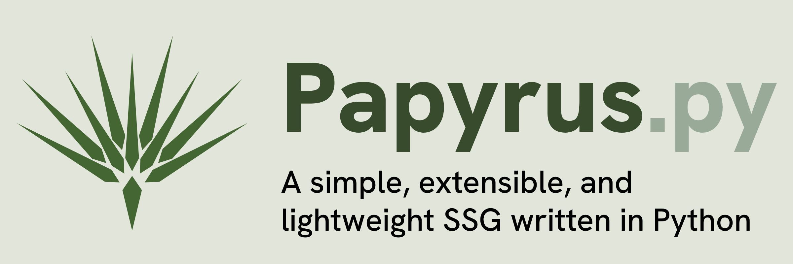

# Papyrus.py



Papyrus.py is a lightweight, extensible Python static site generator that builds a complete website from Markdown content, Jinja templates, and static assets. Papyrus is adapted from the [Cacty.py](https://claudio.uk/posts/cacty.html) SSG developed by Claudio Santini. Papyrus expands on Cacty.py by introducing categories and making it easier to add template converters via classes.

Papyrus runs in your command line and builds your site from templates you define:
```bash
python3 papyrus.py
```
Papyrus is designed for simple publishing workflows:
- Create templates and pages in `templates/`
- Write posts in `posts/*.md`
- Build HTML into `build/`
- And optionally, run watch mode with a local preview server

## Features
- Markdown-to-HTML post generation
- Post metadata support (title, author, date, category, draft)
- Category taxonomy page generation
- Template-driven pages via Jinja (`templates/*.html`, `templates/*.xml`)
- Static asset copying (`static/` -> `build/static/`)
- Site variable management via `config.toml`
- Local development mode with file watching and auto-rebuilds
- Built-in HTTP preview server (`http://localhost:8246`)

## How it works
Papyrus manages the whole build process. Upon running `python papyrus.py`, the script:
1. Loads `config.toml` and updates `build_date`
2. Builds post pages from Markdown (`posts/`) using `templates/post.html`
3. Groups posts by category and builds category pages using `templates/category.html` (if present)
4. Builds top-level pages from `templates/` (excluding partials and collection templates)
5. Copies `static/` files into `build/static/`

In watch mode (`-w`), it monitors project files and rebuilds when changes are detected, then serves the generated site.

## Download Papyrus
Download and copy the git repo to your project folder, or in the project folder, run in your Terminal:
```bash
git clone https://github.com/cealigbe/papyrus.git
```
to clone the repository.

## Project structure
This is the minimum viable file structure for Papyrus to generate your website.
```text
.
├── papyrus.py
├── config.toml
├── posts/
│   └── *.md
├── templates/
│   ├── _base.html
│   ├── post.html
│   ├── category.html
│   └── *.html / *.xml
├── static/
└── build/            # generated output
```

## Requirements
These are the Python dependencies needed to run Papyrus

- Jinja2
- Markdown
- toml
- watchdog
- jinja-markdown
- pymdown-extensions
- PyYAML

Prior to running Papyrus, install the requirements by running the following:
```bash
python -m venv .venv
source .venv/bin/activate
pip install -r requirements.txt
```

## Command-line usage
### Syntax
```bash
python papyrus.py [options]
```

### Arguments
Papyrus currently has one argument `-w` which builds once, then:
- watch files for changes
- auto-rebuild on changes
- start local server on `http://localhost:8246`

### Examples
```bash
# Build once
python papyrus.py

# Build + watch + serve
python papyrus.py -w
```

## Content authoring
Posts in `posts/*.md` should use metadata headers.

Example:
```markdown
    ---
    title: My Post
    description: Short summary of the post
    author: Jane Doe
    category: engineering
    date: 2026-04-05
    draft: false
    ---
    
    Post body in Markdown.
```

### Metadata notes
- `date` is required and must be in `YYYY-MM-DD` format.
- `draft: true` excludes a post from output.
- `category` defaults to `uncategorized` if omitted.

## Templates
Papyrus renders templates from `templates/`:

- `post.html` — individual post page template
- `category.html` — category listing template (optional)
- Other top-level `.html`/`.xml` files — rendered as site pages
- Files beginning with an underscore (`_`) are treated as partials and skipped as standalone pages

Templates receive site/page data and collections:
- `site` (from `config.toml`)
- `page` metadata (id, type, build date)
- `posts` list (for pages listing posts)
- `categories` list (for pages listing categorized posts)

## Output
Generated files are written to:

- `build/posts/*.html`
- `build/categories/*.html`
- `build/*.html` and `build/*.xml`
- `build/static/**`

## Development workflow
1. Update `config.toml`
2. Create/edit posts in `posts/`
3. Create/update templates in `templates/`
4. Run `python papyrus.py -w`
5. Open `http://localhost:8246`

## Additional Utilities
Papyrus.py is extensible for your specific web development needs. You can use `papyrus_filters.py` to add functions to Papyrus, as well as additional page generation classes. An example Folio class and build function are provided for building portfolio collection pages.

There are also additional scripts:
- `papyrus_post.py`: creates a starter markdown post file with metadata in `posts/` for quick blogging
- `papyrus_setup.py`: generates a minimum viable file structure for running Papyrus, complete with templates, CSS, and Javascript files to speed up your web development
- `sitemappr.py`: a simple script that generates a sitemap from the files output in `build/`. Run after your latest Papyrus site build

## Sites Built with Papyrus
- My website, [chuck.aligbe.com](http://chuck.aligbe.com)
- And hopefully yours; feel free to [submit it here](http://chuck.aligbe.com/contact)

## Notes and caveats
- `config.toml` is rewritten during builds to persist updated `build_date`. Make sure to stop the testing server before updated the config file.
- Unknown CLI flags are ignored; only `-w` is currently recognized. Other CLI flags coming soon.

## Inspiration
Papyrus is adapted from the [Cacty.py](https://claudio.uk/posts/cacty.html) SSG developed by Claudio Santini. Papyrus is also inspired by other SSGs which help generate clean and semantic static websites.

## License
This project is distributed under the MIT License, see [LICENSE](https://github.com/cealigbe/papyrus/blob/main/LICENSE) for more info.

## Contributions
Found a bug or have a suggestion? Feel free to open an issue or submit a pull request!


